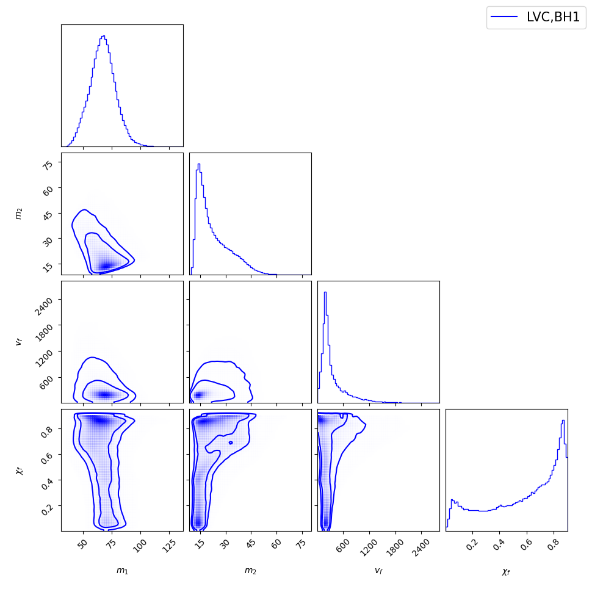
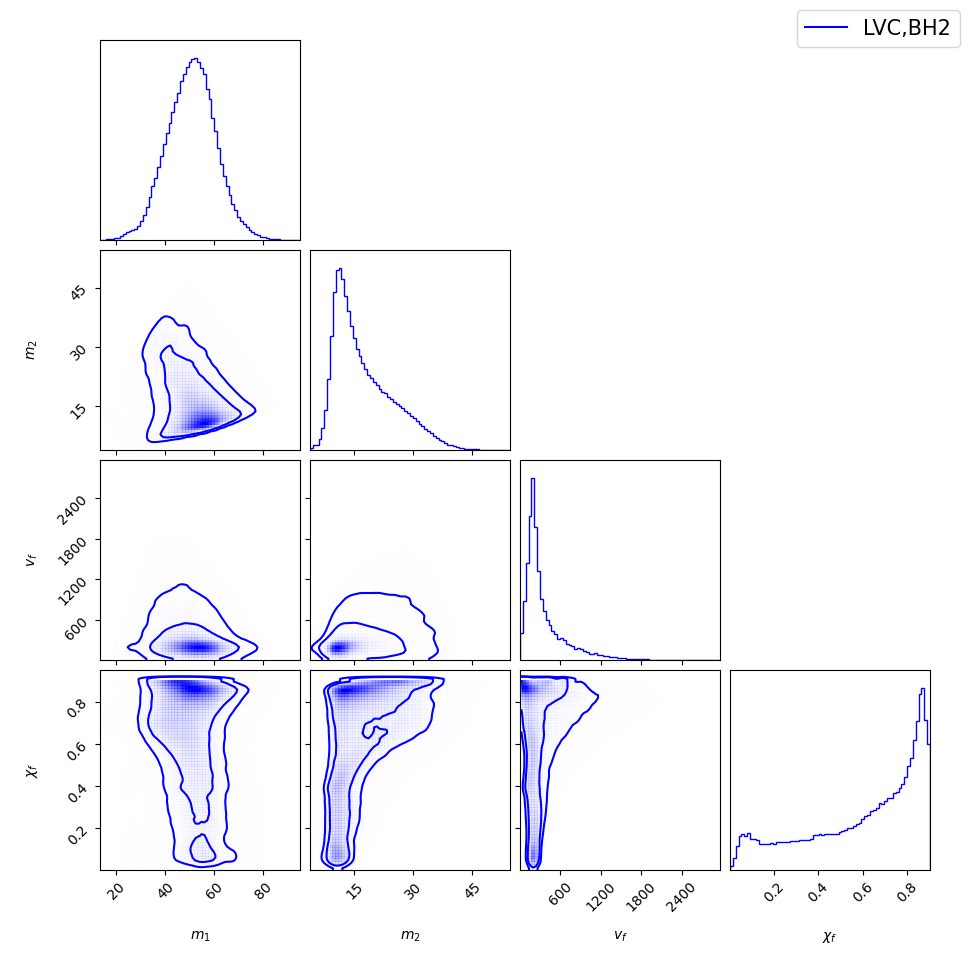

# Ancestral BH
Ancestral BH is a repository for inferring the natal kick and parental masses posterior of black holes in Pair-instability Supernova (PISN) gap. We study the parental black holes of GW190521 and investigate the probability that the component black holes in GW190521 are a result of black hole merger.

---

# Runtime

### LIGO JupyterLab Environment

```bash
# Setup for the environment
pip3 install pyyaml scipy seaborn numpy pandas matplotlib tables corner surfinbh

# Clone the repository
git clone https://github.com/wyhwong/Ancestral-BH.git

# Modify src/configs/main.yml and src/configs/prior.yml according to your needs
cd Ancestral-BH/src
python3 main.py
```

---

### Docker Environment

```bash
# Build Docker image
make build

# Start container (simulation)
make run

# For visualization or development
make jupyter_up
```

---

### Local Environment

```bash
# Install dependencies with poetry
poetry install
```

---

# Application

We can use the scripts in the repository to estimate the parental mass and kick of GW190521. Please find the related data of GW190521 in [LIGO Document P2000158-v4](https://dcc.ligo.org/LIGO-P2000158/public). After downloading the data and modify [main.yml](./src/configs/main.yml) accordingly, we can compute the results. One can also tune the prior settings at [prior.yml](./src/configs/prior.yml) accordingly.

# Demonstration

### Corner plot of the first component black hole in GW190521




### Corner plot of the second component black hole in GW190521



# Authors
[@wyhwong](https://github.com/wyhwong), [@juan.calderonbustillo](https://git.ligo.org/juan.calderonbustillo)
