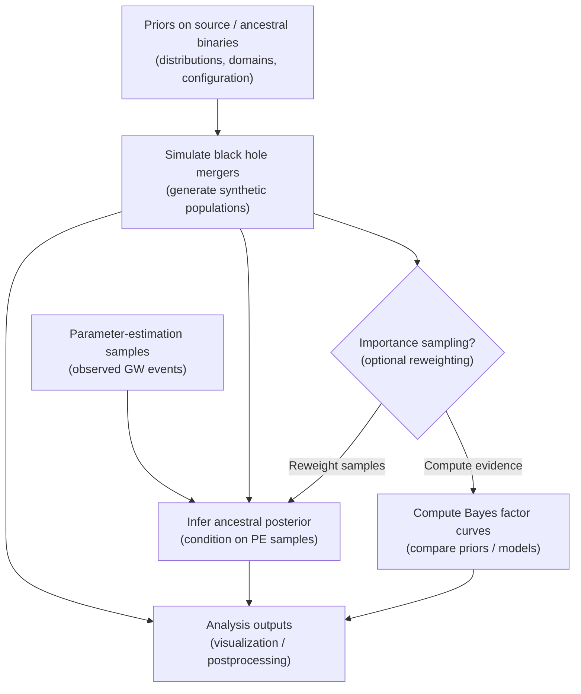
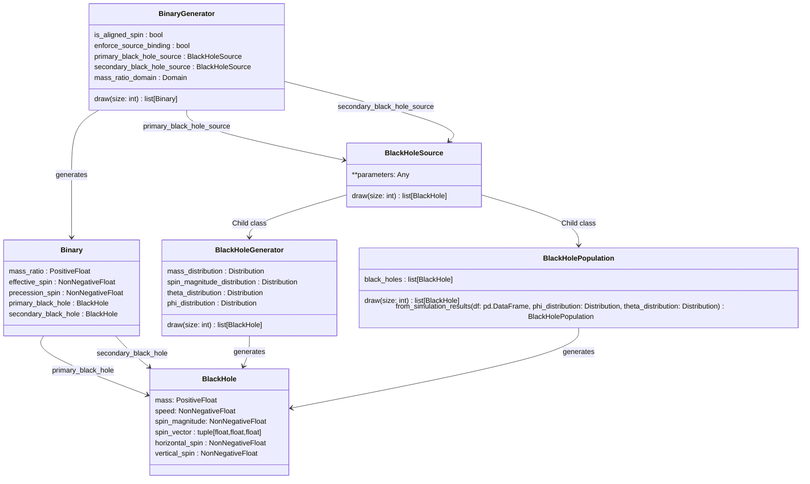
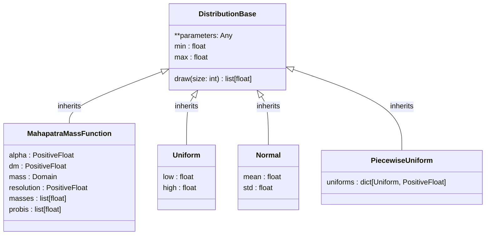
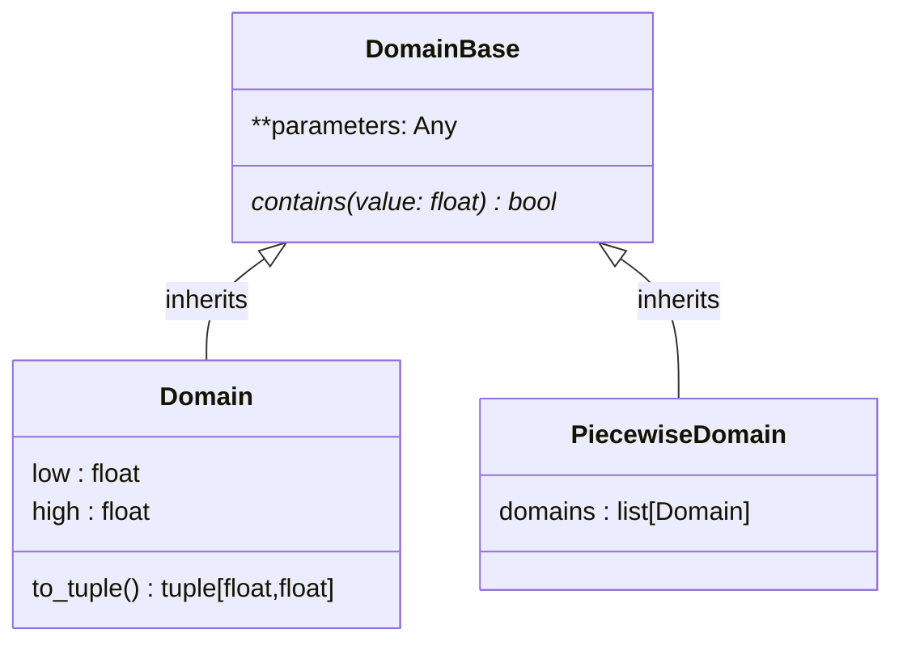
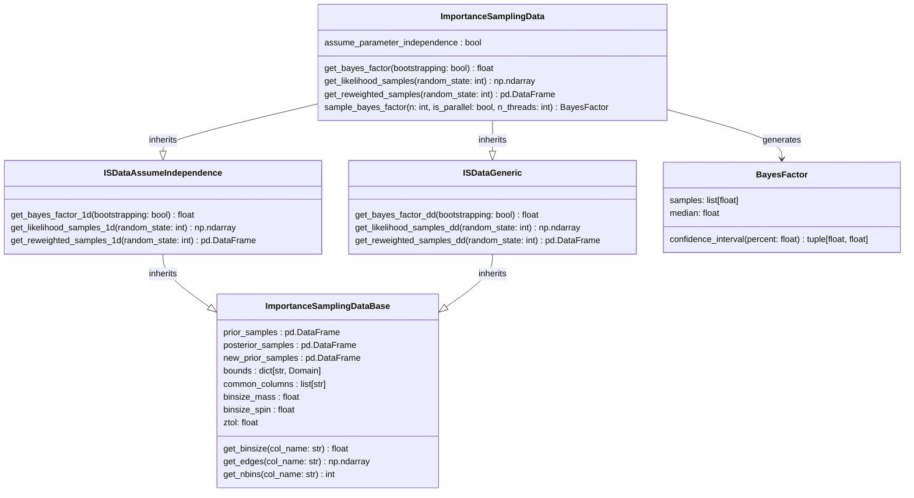
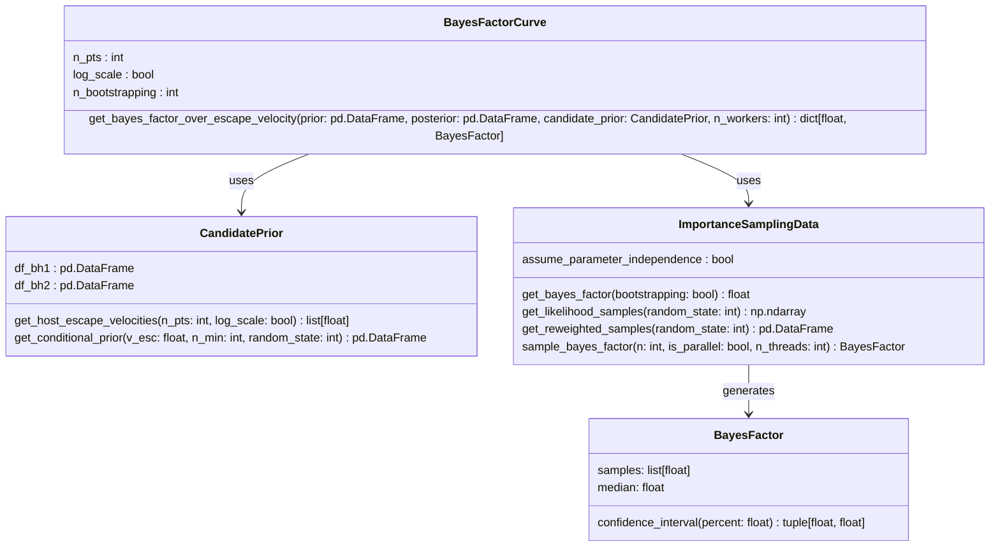

## Conceptual workflow: From GW Observations to Ancestral Inference

This is the “mental model” of how the repository fits together: simulations generate populations, importance sampling connects priors/posteriors, and downstream utilities compute Bayes factors and plots.



**Notes**
- Archeo primarily implements the **backward modeling** workflow (conditioning on existing PE samples), and supports a **forward-like mode via importance sampling** (reweighting under new ancestral priors).

---

## Base Diagrams

In the following, we introduce the data classes used in archeo using UML-style diagrams.

The UML-style diagrams below are originally generated from the codebase using **Pyreverse** ([docs](https://pylint.pycqa.org/en/v2.14.5/pyreverse.html)).
Pyreverse analyzes your source code and generates package and class diagrams.
You can generate the base diagrams with:

```bash
pyreverse -o mmd -d . archeo
```

However, while Pyreverse is great for *complete* diagrams,
full-project graphs often become too dense to read in a browser.
So below we reorganize the output into **smaller, purpose-driven diagrams**:

- Core physical objects: `Binary` and `BlackHole`
- Core sampling primitives: `Distribution` and `Domain`
- Importance sampling: `ImportanceSamplingData` and related classes
- Bayes factor curves: `CandidatePrior`, `BayesFactorCurve`, and related classes

---

## Core Physical Objects: `Binary` and `BlackHole`

Here we introduce the core data models for the repository: `Binary` and `BlackHole`.
These are the fundamental building blocks for simulating populations and performing inference.



For details on the `Distribution` and `Domain` classes, see the next section.

---

## Core Sampling Primitives: Distributions and Domains

This diagram captures the “lego bricks” used to build priors (for masses/spins/etc.) and constrain them, supplementing the `Binary` and `BlackHole` data models.

### Distributions

At the moment, we have implemented a few basic distributions (Uniform, Normal, PiecewiseUniform)
and a custom `MahapatraMassFunction` for modeling mass distributions.
All distributions inherit from a common `DistributionBase` class that defines the interface for sampling and parameter management.



### Domains

Domains are used to define the ranges of parameters (e.g., mass ratio between 1 and 6) and to check whether samples fall within these ranges.



---

## Importance Sampling

Here we introduce the core classes for importance sampling, which is the key technique for forward modeling and reweighting posterior samples under new priors.

The `ImportanceSamplingDataBase` class encapsulates shared data and utilities for importance sampling,
while `ISDataAssumeIndependence` and `ISDataGeneric` implement specific algorithms for computing Bayes factors and reweighted samples under different assumptions.
The `ImportanceSamplingData` class provides a unified interface that can switch between these algorithms based on user configuration.



---

## Importance Sampling: Compute Bayes Factor Curve

Here we introduce the important classes for computing the Bayes factor curve,
which is a key analysis tool for comparing different priors/models.

We first define a `CandidatePrior` class to represent candidate prior distributions
and provide utilities for sampling escape velocities and conditional priors.
Then the `BayesFactorCurve` class computes the Bayes factor as a function of escape velocity
by comparing the candidate prior with the inferred posterior distribution.


